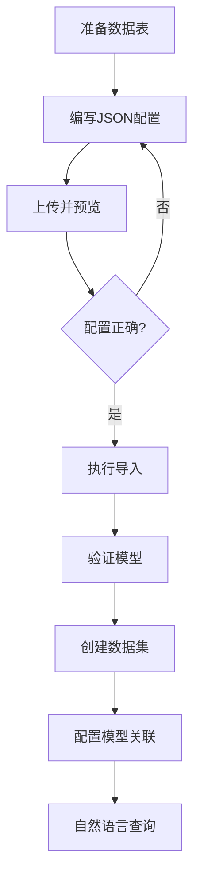

# 📦 SuperSonic 数据集导入功能使用说明

## 🎯 功能概述

数据集导入功能允许通过上传 JSON 配置文件，一键创建完整的数据集（包含模型、指标），极大简化配置流程。

**核心理念**：一个 JSON 文件 = 一个完整的数据集
- ✅ 自动创建多个关联模型
- ✅ 自动创建衍生指标
- ✅ 自动组装成数据集
- ✅ 立即可用于自然语言查询

---

## 🚀 快速开始

### 1. 启动服务

确保 SuperSonic 后端和前端都已启动：
- 后端：`http://localhost:9080`
- 前端：`http://localhost:9000`

### 2. 进入数据集管理页面

1. 登录 SuperSonic
2. 选择左侧菜单：**语义建模** → **数据集管理**
3. 点击右上角 **"导入模型"** 按钮

---

## 📝 使用步骤

### Step 1: 下载模板

点击弹窗中的 **"下载模板"** 按钮，获取示例 JSON 配置文件。

### Step 2: 编辑配置文件

**推荐使用新格式**：`stock_dataset_import.json`（一个数据集包含多个模型）

或使用旧格式：`stock_models_import.json`（兼容，但会创建多个独立数据集）

### Step 3: 上传文件

1. 点击 **"选择JSON文件"**，选择编辑好的配置文件
2. 点击 **"预览"** 按钮，查看将要导入的模型信息
3. 确认无误后，点击 **"导入"** 按钮

### Step 4: 验证结果

导入成功后，在模型列表中查看新创建的模型。

---

## 📋 配置文件格式

### 🆕 新格式（推荐）- 数据集导入

**文件示例**：`stock_dataset_import.json`

**结构**：一个JSON对象，包含数据集配置和多个模型

```json
{
  "dataSetConfig": {
    "name": "股票数据分析",
    "bizName": "StockAnalysis",
    "description": "完整的股票分析数据集",
    "includesAll": true,
    "metrics": [
      {
        "name": "最大涨幅",
        "bizName": "max_gain",
        "expr": "MAX(涨跌幅)",
        "description": "最大涨跌幅"
      }
    ]
  },
  "models": [
    {
      "name": "股票日线数据",
      "bizName": "StockDailyData",
      "isPrimary": true,
      "dbSchema": {...},
      "fields": [...]
    },
    {
      "name": "股票基本信息",
      "bizName": "StockInfo",
      "isPrimary": false,
      "joinCondition": "股票代码 = 股票代码",
      "dbSchema": {...},
      "fields": [...]
    }
  ]
}
```

**特点**：
- ✅ 一个文件创建一个数据集
- ✅ 自动包含所有模型
- ✅ 指标在数据集级别定义
- ✅ 更符合业务逻辑

---

### ⚙️ 旧格式（兼容）- 模型数组

**文件示例**：`stock_models_import.json`

**结构**：JSON数组，每个元素是一个独立模型

### 完整示例（旧格式）

```json
[
  {
    "dbSchema": {
      "db": "stocks_data",
      "table": "stock_zh_a_daily",
      "dbColumns": [
        {
          "columnName": "date",
          "dataType": "DATE",
          "comment": "交易日期"
        },
        {
          "columnName": "code",
          "dataType": "VARCHAR",
          "comment": "股票代码"
        },
        {
          "columnName": "close",
          "dataType": "DECIMAL",
          "comment": "收盘价"
        }
      ]
    },
    "otherRelatedDBSchema": [],
    "modelSchema": {
      "name": "股票日线数据",
      "bizName": "StockDailyData",
      "description": "股票每日交易数据",
      "filedSchemas": [
        {
          "columnName": "date",
          "dataType": "DATE",
          "comment": "交易日期",
          "filedType": "data_time",
          "name": "交易日期",
          "dateFormat": "yyyy-MM-dd",
          "timeGranularity": "day"
        },
        {
          "columnName": "code",
          "dataType": "VARCHAR",
          "comment": "股票代码",
          "filedType": "primary_key",
          "name": "股票代码"
        },
        {
          "columnName": "close",
          "dataType": "DECIMAL",
          "comment": "收盘价",
          "filedType": "measure",
          "name": "收盘价",
          "agg": "AVG"
        }
      ]
    }
  }
]
```

### 字段类型说明

#### filedType（字段类型）

| 类型 | 说明 | 用途 |
|-----|------|-----|
| `primary_key` | 主键 | 唯一标识，用于关联 |
| `foreign_key` | 外键 | 关联其他表 |
| `dimension` | 维度 | 分组、筛选字段 |
| `data_time` | 时间维度 | 时间字段，需指定格式和粒度 |
| `measure` | 度量 | 数值字段，可聚合 |

#### agg（聚合函数）- 用于 measure

| 函数 | 说明 |
|-----|------|
| `SUM` | 求和 |
| `AVG` | 平均值 |
| `MAX` | 最大值 |
| `MIN` | 最小值 |
| `COUNT` | 计数 |
| `COUNT_DISTINCT` | 去重计数 |
| `""` | 不聚合（保留原始值） |

#### timeGranularity（时间粒度）- 用于 data_time

- `day` - 按天
- `week` - 按周
- `month` - 按月

---

## 🎨 最佳实践

### 1. 小模型组合策略

**推荐做法**：创建多个小模型，然后在数据集层面关联

```
❌ 不推荐：创建大宽表
┌────────────────────────────────┐
│ 一个包含所有字段的复杂模型      │
│ （包含JOIN、WHERE等复杂SQL）    │
└────────────────────────────────┘

✅ 推荐：创建小模型
┌──────────────┐       ┌──────────────┐
│ 股票日线数据  │       │ 股票基本信息  │
│ (事实表)     │  ←→   │ (维度表)     │
└──────────────┘       └──────────────┘
         ↓
  在数据集中关联组合
```

### 2. 模型SQL编写原则

✅ **简单的单表查询**
```sql
SELECT date, code, close 
FROM stocks_data.stock_zh_a_daily
```

❌ **避免复杂的SQL**
```sql
-- 不要使用 JOIN
-- 不要使用 WHERE
-- 不要使用 ORDER BY
-- 不要使用 DATE_FORMAT 等函数
-- 不要使用 CASE WHEN
```

### 3. 字段配置建议

- **主键**：每个模型至少一个
- **时间维度**：使用 `data_time` 类型，不要用函数转换
- **度量字段**：如需明细数据，agg 设为空字符串 `""`
- **维度字段**：分类、枚举类型使用 `dimension`

---

## 📁 示例文件

项目提供了完整的股票模型示例：

### `stock_models_import.json`

包含两个模型：
1. **股票日线数据** - 包含价格、涨跌幅、成交量等度量
2. **股票基本信息** - 包含股票名称、行业、市场等维度

**使用方法**：
1. 复制 `stock_models_import.json`
2. 根据实际数据库修改 `db` 和 `table` 名称
3. 在导入界面上传此文件

---

## ⚙️ API 接口

如需通过API调用导入功能：

### 导入模型
```bash
POST /api/semantic/model/import/uploadJson
Content-Type: multipart/form-data

Parameters:
- file: JSON配置文件
- domainId: 领域ID
- databaseId: 数据库ID
```

### 预览配置
```bash
POST /api/semantic/model/import/previewJson
Content-Type: multipart/form-data

Parameters:
- file: JSON配置文件
```

### 下载模板
```bash
GET /api/semantic/model/import/downloadTemplate
```

---

## 🐛 常见问题

### Q1: 上传后提示"JSON格式错误"

**原因**：JSON 语法错误  
**解决**：
1. 使用 JSON 验证工具检查格式
2. 确保所有引号、逗号、括号配对正确
3. 不要有多余的逗号

### Q2: 导入后模型无法查询

**原因**：SQL 太复杂，Calcite 无法解析  
**解决**：
1. 使用简单的单表查询
2. 避免 JOIN、WHERE 等复杂语句
3. 或者在数据库中创建视图，然后引用视图

### Q3: 字段类型配置错误

**原因**：`filedType` 设置不正确  
**解决**：
- 时间字段必须用 `data_time`
- 数值字段用 `measure`
- 文本/枚举字段用 `dimension`
- 每个模型必须有 `primary_key`

### Q4: 导入失败，提示"表不存在"

**原因**：配置文件中的表名不正确  
**解决**：
1. 检查 `dbSchema.db` 和 `dbSchema.table` 是否正确
2. 确认数据库中确实存在该表
3. 注意大小写敏感

---

## 📊 完整工作流程



---

## 🎓 进阶用法

### 1. 批量导入多个模型

一个 JSON 文件可以包含多个模型配置（数组格式）：

```json
[
  { "modelSchema": {...} },  // 模型1
  { "modelSchema": {...} },  // 模型2
  { "modelSchema": {...} }   // 模型3
]
```

### 2. 使用 SQL 作为数据源

`dbSchema.table` 可以直接写 SQL：

```json
{
  "dbSchema": {
    "db": "stocks_data",
    "table": "SELECT date, code, close FROM stock_zh_a_daily WHERE date >= '2025-01-01'",
    "sql": "SELECT date, code, close FROM stock_zh_a_daily WHERE date >= '2025-01-01'",
    "dbColumns": [...]
  }
}
```

### 3. 配置关联表（暂未实现）

`otherRelatedDBSchema` 用于定义关联表，后续版本会支持自动关联。

---

## 📞 技术支持

如有问题，请：
1. 查看后端日志：`logs/s2-info.log`
2. 查看前端控制台错误
3. 提交 Issue 到 GitHub

---

**最后更新**: 2025-10-28  
**适用版本**: SuperSonic v0.9.10+

